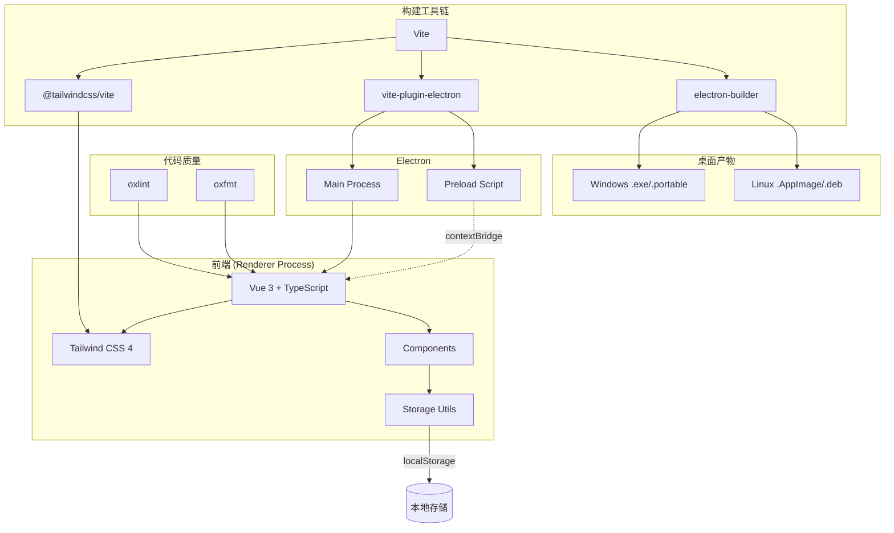

# MyDiary - 个人日记软件

## 项目简介

MyDiary 是一款面向个人的日记软件，采用现代化的用户界面设计，提供日记记录、任务管理、账本管理等功能。界面设计灵感来自"数字 sanctuary"理念，营造出宁静、舒适的写作环境。

## 技术栈

- **前端框架**: Vue 3
- **语言**: TypeScript 6
- **样式**: Tailwind CSS 4
- **构建工具**: Vite 8
- **桌面应用框架**: Electron 42
- **打包工具**: electron-builder 26
- **代码检查**: oxlint (OXC)
- **代码格式化**: oxfmt (OXC)
- **包管理器**: npm / bun
- **字体**: Manrope (标题)、Inter (正文)、Material Symbols Icons (图标)

## 功能特性

### 核心功能

- **日记管理**: 创建、编辑、删除日记条目，支持按日期和分类查看
- **任务管理**: 追踪日常任务和待办事项，支持标记完成状态和设置优先级
- **账本管理**: 记录收入和支出，查看财务统计和分类统计
- **主题切换**: 支持深色/浅色模式切换
- **响应式设计**: 适配不同屏幕尺寸

### 设计特点

- 采用"Intentional Asymmetry"非对称设计
- 色调以自然色系为主（鼠尾草绿、沙色、蓝色）
- 无边框设计，通过背景色调差异区分内容区域
- 毛玻璃效果导航栏
- 柔和的阴影和圆角设计

## 项目结构

```
mydiary/
├── .github/workflows/           # CI/CD 工作流
│   └── build.yml                # 构建与发布 (Windows + Linux)
├── electron/                    # Electron 进程
│   ├── main.ts                  # 主进程
│   └── preload.ts               # 预加载脚本
├── src/                         # 渲染进程
│   ├── components/
│   │   ├── JournalEditor.vue    # 日记编辑器
│   │   ├── LedgerEditor.vue     # 账本编辑器
│   │   └── TaskEditor.vue       # 任务编辑器
│   ├── utils/
│   │   ├── journalStorage.ts    # 日记 localStorage
│   │   ├── ledgerStorage.ts     # 账本 localStorage
│   │   └── taskStorage.ts       # 任务 localStorage
│   ├── App.vue                  # 主应用组件
│   ├── main.ts                  # Vue 入口
│   ├── style.css                # Tailwind CSS + @theme
│   └── vite-env.d.ts            # Vite 类型声明
├── .npmrc                       # npm 镜像配置
├── .oxfmtrc.json                # oxfmt 格式配置
├── .oxlintrc.json               # oxlint 规则配置
├── AGENTS.md                    # AI 参与指南
├── index.html                   # HTML 入口
├── package.json                 # 项目配置与依赖
├── tsconfig.json                # TypeScript 配置
├── tsconfig.node.json           # Node TypeScript 配置
└── vite.config.ts               # Vite 构建配置
```

## 架构



## 开发指南

### 安装依赖

```bash
npm install
```

### 升级依赖

```bash
npm update --save
bun update
```

### 代码检查与格式化

```bash
npm run lint         # oxlint 检查
npm run lint:fix     # oxlint 自动修复
npm run fmt          # oxfmt 格式化
npm run fmt:check    # oxfmt 格式检查 (CI 用)
```

### 开发模式

```bash
npm run dev
```

启动开发服务器，访问 http://localhost:5173 查看 Web 应用。

### 构建 Web 版本

```bash
npm run build
```

产物位于 `dist/` 目录。

### 预览 Web 版本

```bash
npm run preview
```

### Electron 桌面应用

```bash
npm run electron:dev      # Electron 开发模式
npm run electron:preview  # 构建 + 启动 Electron 应用
npm run electron:build    # 打包桌面应用 → release/
```

## CI/CD

推送 `v*` 标签自动触发构建：

1. **build-windows** — 打包 `.exe` / `.portable`
2. **build-linux** — 打包 `.AppImage` / `.deb`
3. **release** — 创建 Draft Release，附带所有构建产物

手动触发：Actions → Build → Run workflow。

## 设计规范

### 色彩系统

| 用途          | 颜色    | Tailwind class          |
| ------------- | ------- | ----------------------- |
| 主色          | #4a654e | primary                 |
| 主色容器      | #8ba88e | primary-container       |
| 背景/表面色   | #fbf9f5 | background / surface    |
| 次要色        | #6b5c4c | secondary               |
| 次要容器      | #f4dfcb | secondary-container     |
| 三级色        | #44617c | tertiary                |
| 三级容器      | #87a4c2 | tertiary-container      |
| 错误色        | #ba1a1a | error                   |

完整色值见 `src/style.css` 的 `@theme` 块。

### 圆角系统

| 名称 | 大小    | 用途         |
| ---- | ------- | ------------ |
| sm   | 0.25rem | 内部嵌套元素 |
| lg   | 0.5rem  | 标准输入框   |
| xl   | 0.75rem | 卡片         |
| 2xl  | 1rem    | 大型卡片     |
| full | 9999px  | 按钮和标签   |

## 许可证

本项目仅供学习交流使用。
