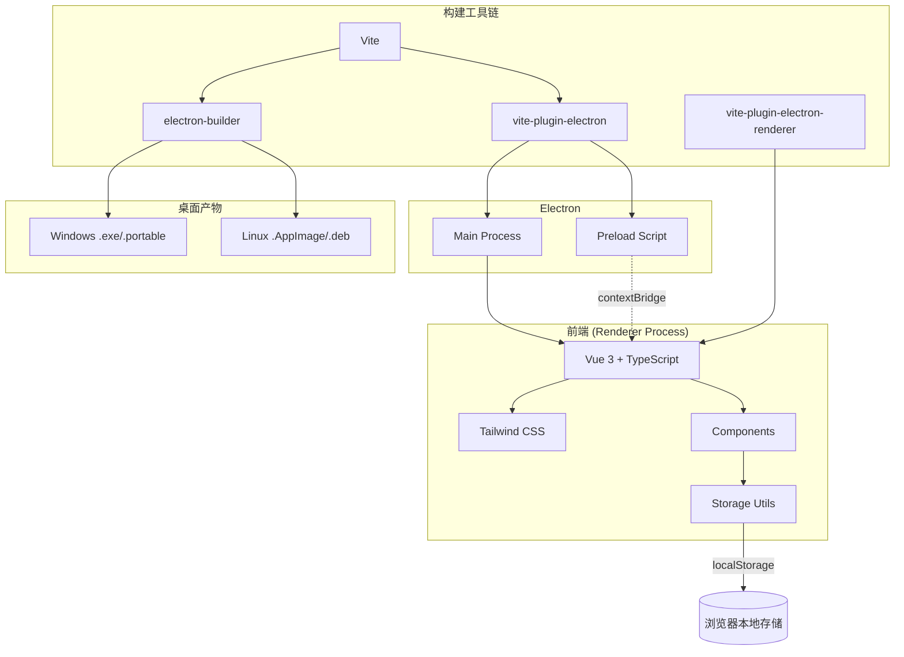

# MyDiary - 个人日记软件

## 项目简介

MyDiary 是一款面向个人的日记软件，采用现代化的用户界面设计，提供日记记录、任务管理、账本管理等功能。界面设计灵感来自"数字 sanctuary"理念，营造出宁静、舒适的写作环境。

## 技术栈

- **前端框架**: Vue 3
- **语言**: TypeScript
- **样式**: Tailwind CSS
- **构建工具**: Vite
- **桌面应用框架**: Electron
- **字体**: Manrope (标题)、Inter (正文)、Material Symbols Icons (图标)

## 功能特性

### 核心功能

- **日记管理**: 创建、编辑、删除日记条目，支持按日期和分类查看
- **任务管理**: 追踪日常任务和待办事项，支持标记完成状态和设置优先级
- **账本管理**: 记录收入和支出，查看财务统计和分类统计
- **主题切换**: 支持深色/浅色模式切换
- **响应式设计**: 适配不同屏幕尺寸

### 设计特点

- 采用"Intentional Asymmetry"非对称设计
- 色调以自然色系为主（鼠尾草绿、沙色、蓝色）
- 无边框设计，通过背景色调差异区分内容区域
- 毛玻璃效果导航栏
- 柔和的阴影和圆角设计

## 项目结构

```
mydiary/
├── electron/                    # Electron 相关文件
│   ├── main.ts                # Electron 主进程
│   └── preload.ts             # Electron 预加载脚本
├── src/                       # 源代码目录
│   ├── components/            # Vue 组件
│   │   ├── JournalEditor.vue  # 日记编辑器组件
│   │   ├── LedgerEditor.vue   # 账本编辑器组件
│   │   └── TaskEditor.vue    # 任务编辑器组件
│   ├── utils/                # 工具函数
│   │   ├── journalStorage.ts  # 日记数据存储
│   │   ├── ledgerStorage.ts   # 账本数据存储
│   │   └── taskStorage.ts    # 任务数据存储
│   ├── App.vue               # 主应用组件
│   ├── main.ts               # 应用入口文件
│   └── style.css             # 全局样式文件
├── .gitignore                # Git 忽略文件配置
├── .npmrc                   # npm 配置文件
├── index.html                # HTML 入口文件
├── package.json             # 项目依赖配置
├── package-lock.json         # 依赖版本锁定
├── README.md                # 项目说明文档
├── start.bat                # Windows 启动脚本
├── tailwind.config.js       # Tailwind CSS 配置
├── tsconfig.json            # TypeScript 配置
├── tsconfig.node.json       # Node.js TypeScript 配置
└── vite.config.ts           # Vite 构建配置
```

## 架构



## 开发指南

### 升级依赖

```bash
npm update --save
bun update
```

### 安装依赖

```bash
npm install
```

### 开发模式

```bash
npm run dev
```

启动开发服务器，访问 http://localhost:5173 查看应用。

### 构建 Web 版本

```bash
npm run build
```

产物位于 `dist/` 目录。

### 预览 Web 版本

```bash
npm run preview
```

### 构建 Electron 桌面应用

```bash
npm run electron:build
```

产物位于 `release/` 目录。

### 启动 Electron 应用（开发模式）

```bash
npm run electron:dev
```

### 预览 Electron 应用（生产模式）

```bash
npm run electron:preview
```

## 设计规范

### 色彩系统

| 用途          | 颜色    | 变量名                    |
| ------------- | ------- | ------------------------- |
| 主色          | #4a654e | primary                   |
| 主色容器      | #8ba88e | primary-container         |
| 背景色        | #fbf9f5 | background/surface        |
| 表面容器-低   | #f5f3ef | surface-container-low     |
| 表面容器      | #efeeea | surface-container         |
| 表面容器-高   | #eae8e4 | surface-container-high    |
| 表面容器-最高 | #e4e2de | surface-container-highest |
| 次要色        | #6b5c4c | secondary                 |
| 次要容器      | #f4dfcb | secondary-container       |
| 三级色        | #44617c | tertiary                  |
| 三级容器      | #87a4c2 | tertiary-container        |

### 圆角系统

| 名称 | 大小    | 用途         |
| ---- | ------- | ------------ |
| sm   | 0.25rem | 内部嵌套元素 |
| lg   | 0.5rem  | 标准输入框   |
| xl   | 0.75rem | 卡片         |
| 2xl  | 1rem    | 大型卡片     |
| full | 9999px  | 按钮和标签   |

## 许可证

本项目仅供学习交流使用。
